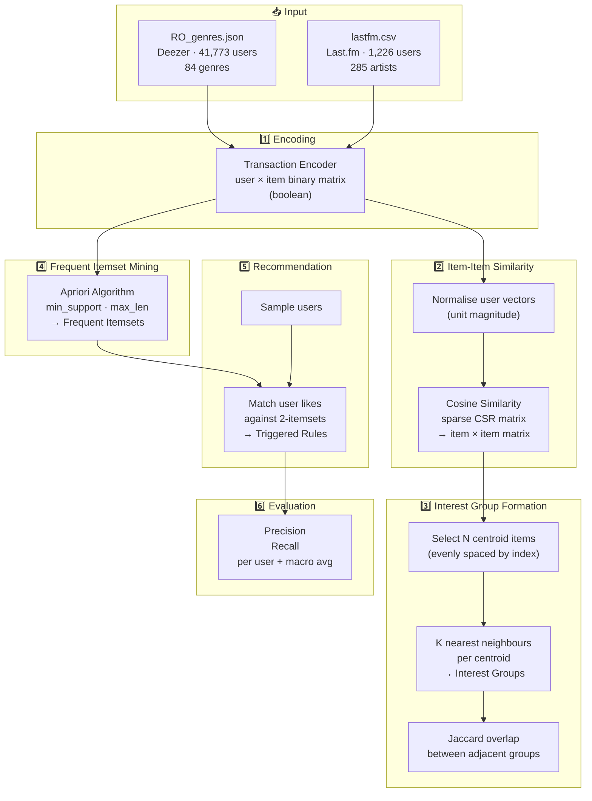

# Privacy-Preserving Association Rule Mining

A machine learning project focused on clustering and recommendation systems using association rule mining techniques on music streaming datasets. This implementation provides privacy-aware user interest modeling and personalized content recommendations.

## �️ Architecture



## 🎯 General Use Case

The pipeline answers:
> *"Given a user's listening/genre history, which other items are they likely to enjoy — without building an individual user profile?"*

Privacy is preserved by working exclusively with **aggregate co-occurrence patterns** (frequent itemsets) rather than storing or exposing per-user preference vectors:

| Stage | What happens | Privacy angle |
|-------|-------------|---------------|
| Encoding | Raw preferences → boolean matrix | User IDs are positional indices only |
| Similarity | Item-item cosine similarity | No user-level similarity is computed |
| Interest groups | Centroid neighbours define genre clusters | Groups represent item clusters, not user clusters |
| Apriori | Frequent co-occurrence patterns mined | Only patterns above a support threshold are retained — rare/unique preferences are suppressed |
| Recommendation | Association rules triggered by likes | Rules fire on aggregate patterns; individual rare tastes fall below the support threshold |

### Quick Start (MVP)

```bash
python3 -m venv .venv && source .venv/bin/activate
pip install -r requirements.txt

# Deezer  (41,773 users × 84 genres)
python mvp.py

# Last.fm  (1,226 users × 285 artists)
python mvp.py --dataset lastfm

# Tune parameters
python mvp.py --dataset deezer --min-support 0.15 --n-groups 8 --n-users 20
```

## �📋 Project Overview

This project implements privacy-preserving techniques to:
- **Model user interests** through clustering algorithms
- **Group users** with similar preferences
- **Generate personalized recommendations** using frequent pattern mining
- **Evaluate clustering quality** and recommendation effectiveness

The system is designed to work with music streaming datasets while maintaining privacy considerations in data analysis.

## 📊 Datasets

The project utilizes the following datasets:

### Deezer Dataset
- **Source**: Deezer music streaming service (November 2017)
- **Format**: `RO_genres.json` - User preferences with genre information
- **Countries**: Romanian user network
- **Content**: User IDs mapped to liked genres (84 distinct genres)
- **Network**: Friendship networks with mutual connections

### Last.fm Dataset
- **Format**: `lastfm.csv` - User-item interaction data
- **Content**: User engagement with music items

## 🏗️ Project Structure

```
PrivacyPreservingAssociationRuleMining/
├── src/                          # Source code modules
│   ├── clustering/               # Clustering algorithms
│   ├── recommendation/           # Recommendation systems
│   └── evaluation/               # Evaluation metrics
├── data/                         # Datasets
│   ├── RO_genres.json           # Deezer Romanian user genres
│   ├── lastfm.csv               # Last.fm user data
│   └── other datasets
├── notebooks/                    # Jupyter notebooks (if any)
├── results/                      # Output and results
│   ├── experiment.csv
│   ├── result.csv
│   └── out.csv
├── README.md                     # This file
└── requirements.txt              # Python dependencies
```

## 🔧 Key Components

### Clustering Algorithms

1. **K-Means Clustering**
   - `K_means_clustering.py` - TF-IDF based K-means implementation
   - `K_means_clustering_nltk.py` - NLTK-based K-means clustering
   - `K_means_clusterng2.py` - Alternative K-means implementation

2. **Affinity Propagation**
   - `Clusters_affinity_propogation.py` - Affinity propagation clustering
   
3. **Centroid-Based Clustering**
   - `k_centroid.py` - K-centroid clustering implementation

### Main System Models

1. **Deezer Model** (`Deezer.py`)
   - Interest modeling through clustering
   - User grouping based on genre preferences
   - Content recommendation generation
   - Dataset: Romanian Deezer users with genre preferences

2. **Last.fm Model** (`Lastfm.py`)
   - Interest group formation
   - Association rule mining with Apriori algorithm
   - Centroid-based interest group formation
   - User recommendations

### Evaluation

- `Evaluation_matplot_deezer.py` - Comprehensive evaluation on Deezer dataset
  - Interest group cluster analysis
  - Recommendation quality assessment
  - Visualization using matplotlib

## 📦 Dependencies

The project uses the following key libraries:

```python
scikit-learn        # Machine learning algorithms (KMeans, clustering metrics)
mlxtend             # Frequent pattern mining (Apriori algorithm)
pandas              # Data manipulation and analysis
numpy               # Numerical computing
scipy               # Scientific computing (sparse matrices, interpolation)
matplotlib          # Visualization and plotting
gensim              # Doc2Vec embeddings
nltk                # Natural language processing
```

## 🚀 Installation

1. **Clone the repository**
   ```bash
   git clone https://github.com/pavankumarmerugu/PrivacyPreservingAssociationRuleMining.git
   cd PrivacyPreservingAssociationRuleMining
   ```

2. **Create virtual environment**
   ```bash
   python3 -m venv .venv
   source .venv/bin/activate   # Windows: .venv\Scripts\activate
   ```

3. **Install dependencies**
   ```bash
   pip install -r requirements.txt
   ```

## 💻 Usage

### Running Deezer Analysis
```bash
python Deezer.py
```

### Running Last.fm Analysis
```bash
python Lastfm.py
```

### Running Clustering Analysis
```bash
python K_means_clustering.py
```

### Running Evaluation
```bash
python Evaluation_matplot_deezer.py
```

## 🔍 Algorithm Overview

### Association Rule Mining
- **Apriori Algorithm**: Used to discover frequent itemsets in user-item transactions
- **Support Threshold**: 0.01 (1% minimum support)
- **Transaction Encoder**: Converts transaction data into boolean DataFrame format

### Clustering Methods
- **K-Means++**: Initialization strategy for centroid selection
- **Cosine Similarity**: Metric for measuring item/genre similarity
- **TF-IDF Vectorization**: Feature extraction for text-based clustering

### User Grouping
- Interest groups formed based on genre preferences
- Centroid-based representation of group interests
- Similarity-based user assignment to interest groups

## 📈 Results

The system generates various outputs:

- `experiment.csv` - Experimental results and metrics
- `result.csv` - Final recommendation results
- `out.csv` - Processed output data
- Visualizations: Matplotlib plots for cluster analysis

## 🔐 Privacy Considerations

This project implements privacy-preserving techniques:
- Anonymized user IDs (reindexed for privacy)
- Aggregate-level recommendations
- Interest-based grouping rather than individual user tracking
- Association rule mining for pattern discovery without individual profiling

## 📝 File Descriptions

| File | Purpose |
|------|---------|
| `Deezer.py` | Main Deezer dataset analysis system |
| `Lastfm.py` | Main Last.fm dataset analysis system |
| `K_means_clustering.py` | K-means clustering implementation |
| `K_means_clustering_nltk.py` | NLTK-based K-means clustering |
| `Clusters_affinity_propogation.py` | Affinity propagation clustering |
| `k_centroid.py` | K-centroid clustering |
| `Evaluation_matplot_deezer.py` | Cluster and recommendation evaluation |
| `RO_genres.json` | Deezer genre preference data |
| `lastfm.csv` | Last.fm user data |

## 🎯 Objectives

1. Implement privacy-aware clustering algorithms
2. Mine association rules from user preferences
3. Generate privacy-preserving recommendations
4. Evaluate system performance on real music datasets
5. Analyze interest group quality and diversity

## 📚 References

- **Deezer Dataset**: Friendship networks from Deezer music streaming service
- **Last.fm Dataset**: User-item interaction data from Last.fm platform
- **Apriori Algorithm**: Frequent pattern mining for association rules
- **K-Means Clustering**: Unsupervised learning for user grouping

## 🤝 Contributing

Contributions are welcome! Please feel free to:
- Report issues
- Suggest improvements
- Submit pull requests
- Improve documentation

## 📄 License

Please check the LICENSE file for licensing information.

## 👤 Author

**Pavan Kumar Merugu**
- GitHub: [@pavankumarmerugu](https://github.com/pavankumarmerugu)

## ⚠️ Notes

- Ensure datasets are in the correct location (`data/` directory)
- Update file paths in scripts if datasets are moved
- Results will be saved to the `results/` directory
- Large datasets may require significant memory; consider using sparse matrix representations

## 🐛 Troubleshooting

### Common Issues

1. **ModuleNotFoundError**: Install missing dependencies with `pip install -r requirements.txt`
2. **FileNotFoundError**: Ensure datasets are in the `data/` directory
3. **Memory Issues**: Consider using sparse matrices or processing data in chunks

## 📞 Support

For issues or questions, please open an issue on the GitHub repository or contact the author.

---

**Last Updated**: May 2026
